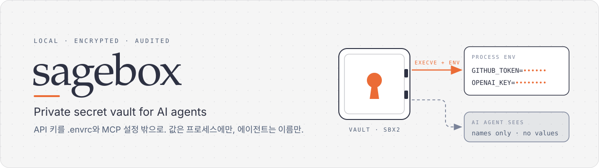

# sagebox

<p align="center"></p>

<p align="center"><a href="README.md">English</a> · <b>한국어</b></p>

**AI 에이전트를 위한 개인 비밀 금고.** API 키·비밀번호를 `.envrc`나 MCP 설정 파일에 평문으로 두지 않고, 암호화된 금고(vault)에 넣어 두었다가 필요한 프로그램에만 환경변수로 넣어 줍니다.

- 비밀 값은 디스크에 평문으로 남지 않습니다(XChaCha20-Poly1305 + Argon2id 암호화).
- 에이전트(Claude Code 등)는 비밀의 **이름만** 볼 수 있고, **값**은 보지 못합니다.
- 잠금 해제는 패스프레이즈나 Touch ID로 하고, 모든 사용 기록은 위조 방지 감사 로그에 남습니다.
- Rust로 만든 작은 실행 파일 하나이고, 네트워크 포트를 열지 않습니다.

> sagebox는 **비밀 위생** 도구입니다. 평문 파일이 커밋되거나 비밀이 대화 기록에 남는 사고를 막습니다. 같은 사용자 계정에서 도는 악성 프로그램까지 막아 주지는 않습니다. 자세한 내용은 [SPEC.md의 위협 모델](SPEC.md)을 보세요.

---

## 목차

1. [왜 필요한가요?](#왜-필요한가요)
2. [설치](#설치)
3. [5분 만에 써 보기](#5분-만에-써-보기)
4. [사용법](#사용법)
5. [동작 원리](#동작-원리)
6. [코드 구조](#코드-구조)
7. [코드 수정하기](#코드-수정하기)
8. [문제 해결](#문제-해결)

---

## 왜 필요한가요?

보통 비밀은 이렇게 관리합니다.

```sh
# .envrc  ← 실수로 git에 커밋하면 키가 공개됩니다
export OPENAI_API_KEY=sk-진짜키...
```

```json
// ~/.claude.json  ← MCP 설정 파일에 토큰이 평문으로 들어갑니다
"github": { "command": "npx", "env": { "GITHUB_TOKEN": "ghp_진짜토큰..." } }
```

sagebox를 쓰면 이렇게 바뀝니다.

```sh
# .envrc에는 비밀이 없습니다. 비밀은 금고에서 꺼내 이 명령에만 넣습니다.
sagebox run -- npm run dev
```

```json
// MCP 설정에는 "sagebox로 실행하라"는 내용만 남습니다
"github": { "command": "/opt/homebrew/bin/sagebox", "args": ["exec", "github"] }
```

---

## 설치

sagebox는 macOS와 Linux에서 동작합니다(Windows는 아직 컴파일만 됩니다).

### Homebrew (권장)

```sh
brew install sparktype/tap/sagebox
sagebox          # 사용법이 출력되면 성공입니다
```

Homebrew는 소스에서 빌드하므로, 처음 설치할 때 빌드용 Rust도 함께 설치됩니다. 나중에 업데이트할 때는 `brew upgrade sagebox`를 실행합니다.

### Cargo로 소스에서 설치

[Rust](https://rustup.rs) 1.85 이상이 필요합니다(`rustc --version`으로 확인).

```sh
cargo install --git https://github.com/sparktype/sagebox
```

실행 파일은 `~/.cargo/bin/sagebox`에 설치되며, 이 경로가 `PATH`에 있어야 합니다. 나중에 Homebrew로 바꾼다면 먼저 `cargo uninstall sagebox`로 예전 것을 지워야 새 것이 가려지지 않습니다.

---

## 5분 만에 써 보기

### 1) 금고 만들기

```sh
sagebox init
# new passphrase:     ← 8자 이상. 잊으면 복구할 수 없습니다!
# repeat passphrase:
```

### 2) 비밀 넣기

```sh
sagebox set gh
# passphrase:          ← 금고 패스프레이즈
# value for gh:        ← 저장할 값 (화면에 보이지 않습니다)

sagebox list           # 이름만 보입니다. 값은 절대 출력하지 않습니다.
```

만료일도 지정할 수 있습니다. 만료된 비밀은 꺼내지지 않습니다.

```sh
sagebox set gh --expires 2027-01-01
```

### 3) (macOS) Touch ID 켜기

```sh
sagebox touchid enable
```

이제 잠금 해제할 때 패스프레이즈 대신 Touch ID(또는 Apple Watch, 로그인 암호)를 쓸 수 있습니다. 패스프레이즈는 복구용으로 항상 남아 있습니다.

### 4) MCP 서버에 비밀 연결하기

```sh
sagebox mcp add github --env GITHUB_TOKEN=gh -- npx -y @modelcontextprotocol/server-github
```

이 명령 하나가 세 가지를 합니다.

1. `npx`를 지금 위치의 절대경로로 고정합니다. 나중에 PATH가 바뀌어도 다른 프로그램이 끼어들지 못합니다.
2. 금고에 `github` **프로필**을 만듭니다. 프로필은 "`GITHUB_TOKEN` 환경변수에 `gh` 비밀을 넣어서 이 명령을 실행하라"는 규칙입니다.
3. `claude mcp add`로 Claude Code에 등록합니다.

이제 Claude Code가 github MCP 서버를 켤 때 sagebox가 비밀을 넣어 줍니다. 금고가 잠겨 있으면 Touch ID 창이 뜹니다.

---

## 사용법

### 기본 명령

| 명령 | 하는 일 |
|------|---------|
| `sagebox init` | 새 금고를 만듭니다 |
| `sagebox set <이름> [--expires YYYY-MM-DD]` | 비밀을 넣거나 바꿉니다 |
| `sagebox rm <이름>` | 비밀을 지웁니다 (프로필이 쓰고 있으면 거부) |
| `sagebox list` | 비밀 이름, 만료일, 프로필을 보여 줍니다 |
| `sagebox unlock` / `lock` / `status` | 세션을 풀고, 잠그고, 상태를 봅니다 |
| `sagebox audit verify` | 감사 로그가 조작되지 않았는지 검사합니다 |

### MCP 서버 관리

| 명령 | 하는 일 |
|------|---------|
| `sagebox mcp add <서버> --env VAR=비밀 -- <명령>` | 프로필을 만들고 Claude Code에 등록합니다 |
| `sagebox import <mcp.json> [--apply]` | 기존 MCP 설정의 평문 비밀을 금고로 옮깁니다. `--apply` 없이 실행하면 미리보기만 합니다 |
| `sagebox profile add/rm` | 프로필을 직접 만들고 지웁니다 |
| `sagebox exec <프로필>` | 프로필대로 비밀을 넣어 실행합니다 (MCP 설정이 부르는 명령) |
| `sagebox mcp serve` | sagebox 자체 MCP 서버를 켭니다 (아래 참고) |

### 프로젝트 `.envrc` 대체하기

개발할 때 쓰는 비밀(`.envrc`, `.env`)을 금고로 옮기는 흐름입니다.

```sh
cd ~/my-project
sagebox import-env .envrc            # 1. 미리보기: 무엇을 옮길지 이름만 보여 줍니다
sagebox import-env .envrc --apply    # 2. 적용: 비밀 줄을 금고로 옮기고 .envrc에서 지웁니다
```

- 프로젝트마다 **네임스페이스**(별도 금고)가 생기고, 프로젝트 폴더에 `.sagebox` 파일이 만들어집니다.
- `LOG_LEVEL=debug`처럼 비밀이 아닌 줄은 그대로 남습니다.
- 잘못 분류된 변수는 `--keep VAR`로 남겨 둘 수 있습니다.
- 이미 git에 커밋된 적이 있는 파일이라면 경고가 나옵니다. 히스토리에 남은 키는 **반드시 새로 발급**하세요.

이후 디버깅할 때는 명령 앞에 `sagebox run --`을 붙입니다.

```sh
sagebox run -- cargo run
sagebox run -- npm run dev
```

> **주의:** `sagebox run`은 **sagebox MCP 서버가 떠 있을 때만**(= 이 프로젝트에서 Claude Code를 켜 둔 동안) 동작합니다. 먼저 한 번 등록해 두세요.
>
> ```sh
> claude mcp add -s user sagebox -- "$(command -v sagebox)" mcp serve
> ```

### 셸 훅: cd할 때 자동 검사

`~/.zshrc`(bash라면 `~/.bashrc`)에 한 줄을 추가합니다.

```sh
eval "$(sagebox zsh)"     # bash라면: eval "$(sagebox bash)"
```

이제 `.envrc`/`.env`에 평문 비밀이 있는 폴더로 들어가면 이렇게 물어봅니다.

```
sagebox: .envrc has plaintext secrets:
  OPENAI_API_KEY [token prefix]
move them into the vault and remove them from .envrc? [y/N]
```

`y`를 누르면 `import-env --apply`와 같이 정리합니다. `N`을 누르면 그 셸에서는 다시 묻지 않습니다.

### 네임스페이스 (프로젝트별 금고)

| 방법 | 예 |
|------|----|
| 명령행 옵션 | `sagebox --ns acme list` |
| 환경변수 | `SAGEBOX_NS=acme sagebox list` |
| 프로젝트 파일 | 폴더(또는 상위 폴더)의 `.sagebox` 파일에 `namespace = "acme"` |
| 기본값 | `default` (`~/.sagebox/`) |

위에서부터 우선순위가 높습니다. `sagebox ns`로 지금 어떤 네임스페이스가 선택됐는지 볼 수 있습니다. `.sagebox` 파일로 고른 네임스페이스는 그 폴더가 `sagebox trust`로 등록돼 있어야 쓸 수 있습니다. 누군가 `.sagebox` 파일을 몰래 넣어 다른 프로젝트의 비밀을 꺼내는 것을 막기 위해서입니다.

### sagebox MCP 서버

`sagebox mcp serve`는 에이전트에게 도구 두 개를 줍니다.

- `status`: 금고가 잠겨 있는지, 몇 개의 서버가 비밀을 쓰고 있는지
- `list`: 비밀 이름·만료일, 프로필 목록

**비밀 값은 어떤 도구로도 돌려주지 않습니다.** 이 서버가 떠 있는 동안에만 `sagebox run`이 허용됩니다.

---

## 동작 원리

```
  사용자 ──(패스프레이즈)──▶ 관리 CLI ──(암호화해서 저장)──▶ 금고 파일 (~/.sagebox/vault)
                                                              ▲
  사용자 ──(unlock / Touch ID)──▶ 데몬 ──(DEK로 열기)────────┘
                                 │ ▲
               (명령 + 환경변수) ▼ │ (요청)
  에이전트 ──(실행)──▶ sagebox exec ──(execve)──▶ MCP 서버 (환경변수에만 비밀이 있음)
```

핵심 개념 네 가지입니다.

1. **봉투 암호화.** 금고 본문은 무작위 키(DEK)로 암호화되고, DEK는 패스프레이즈나 Touch ID로 여는 "슬롯"에 들어 있습니다. 슬롯을 추가해도 본문을 다시 암호화할 필요가 없습니다.
2. **관리는 데몬을 거치지 않습니다.** `set`, `rm`, `profile add` 같은 명령은 매번 패스프레이즈로 금고 파일을 직접 고칩니다. 그래서 세션이 풀려 있어도 에이전트가 규칙을 바꿀 수 없습니다.
3. **데몬은 필요할 때만 삽니다.** 첫 `exec`나 `unlock`이 데몬을 자동으로 띄웁니다. 데몬은 메모리에 DEK만 들고 있다가, 마지막 MCP 서버가 끝나고 30초가 지나거나 8시간이 되면, 또는 잠자기나 화면 잠금 때 DEK를 지우고 종료합니다.
4. **임대(lease).** `exec`는 데몬과 연결한 소켓을 MCP 서버 프로세스에 물려준 채 `execve`합니다. 데몬은 그 소켓이 닫히는 것을 보고 서버가 끝났다는 것을 압니다.

그림으로 보려면 [`docs/diagrams/architecture.html`](docs/diagrams/architecture.html)을 브라우저로 여세요. 설계 결정과 그 이유는 [`SPEC.md`](SPEC.md)와 [`context-notes.md`](context-notes.md)에 있습니다.

---

## 코드 구조

```
src/
├── main.rs        명령행 인자를 읽어 알맞은 함수로 보내는 입구 (USAGE, match 문)
├── vault.rs       금고 파일 형식: 암호화·복호화, 슬롯, Vault 구조체
├── admin.rs       관리 명령: init, set, rm, list, profile, trust, audit verify
├── namespace.rs   어떤 네임스페이스를 쓸지 결정
├── daemon.rs      데몬: 세션(DEK) 보관, 요청 처리, 임대, 자동 종료
├── client.rs      데몬에 요청하는 쪽: unlock, lock, status, exec, run
├── audit.rs       감사 로그 (줄마다 MAC을 이어 거는 체인)
├── mcp.rs         sagebox mcp add
├── mcp_server.rs  sagebox mcp serve (stdio JSON-RPC)
├── import.rs      MCP 설정 가져오기 + 비밀 판별기(classify)
├── envfile.rs     .envrc 가져오기, sagebox env, 셸 훅
├── prompt.rs      GUI 패스프레이즈 창 (osascript / zenity / kdialog / pinentry)
├── touchid.rs     Touch ID 슬롯 관리 (macOS)
├── macos.rs       macOS 시스템 호출 (화면 잠금, Secure Enclave)
└── debug.rs       SAGEBOX_DEBUG=1일 때만 쓰는 디버그 로그
tests/cli.rs       실제 실행 파일을 돌려 보는 통합 테스트
```

모든 소스 파일의 첫 줄에는 그 파일의 역할을 한 줄로 적은 한국어 주석이 있습니다. 어디부터 볼지 모르겠으면 `head -1 src/*.rs`로 훑어보세요.

**읽는 순서 추천:** `main.rs`(어떤 명령이 어디로 가는지) → `admin.rs`의 `list`(가장 단순한 명령) → `vault.rs`의 `Vault` 구조체 → `client.rs`의 `exec` → `daemon.rs`의 `handle`.

---

## 코드 수정하기

### 1. 빌드와 테스트

```sh
cargo build                                  # 디버그 빌드 → target/debug/sagebox
cargo test                                   # 전체 테스트
cargo test hook_check                        # 이름에 hook_check가 들어간 테스트만
cargo clippy --all-targets -- -D warnings    # 경고가 하나라도 있으면 실패
cargo fmt                                    # 코드 서식 맞추기
```

Windows에서도 컴파일되는지 확인합니다(타깃은 한 번만 설치하면 됩니다).

```sh
rustup target add x86_64-unknown-linux-gnu x86_64-pc-windows-msvc
cargo check --all-targets --target x86_64-unknown-linux-gnu
cargo check --all-targets --target x86_64-pc-windows-msvc
```

**변경을 마치기 전에 네 가지(test, clippy, fmt, 크로스 컴파일)가 모두 통과해야 합니다.**

### 2. 내 금고를 건드리지 않고 실험하기

`SAGEBOX_HOME`을 바꾸면 임시 폴더를 금고 위치로 씁니다.

```sh
export SAGEBOX_HOME=/tmp/sbx-play
export SAGEBOX_NO_GUI=1          # GUI 창 대신 터미널에서 묻기
export SAGEBOX_DEBUG=1           # 판단 과정을 stderr와 debug.log에 기록

./target/debug/sagebox init
printf 'mypassword\nsecret-value\n' | ./target/debug/sagebox set demo
```

터미널이 아닌 곳(파이프)에서 실행하면, 패스프레이즈와 값을 **stdin에서 한 줄씩 순서대로** 읽습니다. 테스트도 이 방식을 씁니다.

### 3. 예제: 새 명령 추가하기

비밀 개수를 세는 `sagebox count`를 추가한다고 해 봅시다.

**① 기능 함수 작성** (`src/admin.rs`)

```rust
/// 비밀 개수를 출력한다. 값은 출력하지 않는다.
pub fn count(path: &Path) -> Result<()> {
    let (_, v, _) = unlock(path)?;          // 패스프레이즈로 금고 열기
    println!("{}", v.secrets.len());
    Ok(())
}
```

**② 명령 연결** (`src/main.rs`)

`USAGE` 문자열에 한 줄을 추가하고, `match args` 안에 분기를 추가합니다.

```rust
        ["count"] => admin::count(&vault),
```

**③ 테스트 작성** (`tests/cli.rs`)

```rust
#[test]
fn count_secrets() {
    let home = std::env::temp_dir().join(format!("sbx-count-{}", std::process::id()));
    let _ = std::fs::remove_dir_all(&home);
    assert!(sbx(&home, "password\npassword\n", &["init"]).status.success());
    assert!(sbx(&home, "password\nv1\n", &["set", "a"]).status.success());

    let o = sbx(&home, "password\n", &["count"]);
    assert_eq!(String::from_utf8_lossy(&o.stdout), "1\n");
    std::fs::remove_dir_all(&home).unwrap();
}
```

`sbx(home, stdin, args)`는 테스트용 도우미 함수입니다. 임시 `SAGEBOX_HOME`으로 실행 파일을 돌리고, `stdin` 문자열을 한 줄씩 입력으로 넣어 줍니다.

**④ 확인**

```sh
cargo test count_secrets
cargo clippy --all-targets -- -D warnings && cargo fmt
```

**⑤ 문서 갱신**: 설계가 바뀌었다면 `SPEC.md`, 진행 상황은 `checklist.md`, 결정 이유는 `context-notes.md`에 적습니다. 흐름이 바뀌었다면 `docs/diagrams/architecture.html`도 고칩니다.

### 4. 꼭 지켜야 할 규칙

| 규칙 | 이유 |
|------|------|
| 비밀 값은 `Zeroizing<String>`에 담고, 절대 출력·로그·`Debug`로 찍지 않습니다 | 메모리에서 지워지고, 화면이나 로그에 남지 않게 하려고 |
| 암호 알고리즘을 직접 만들지 않습니다. 검증된 RustCrypto 크레이트만 씁니다 | 직접 만든 암호는 거의 항상 취약합니다 |
| 의존성은 꼭 필요할 때만 추가하고, 추가 이유를 설명합니다 | 작은 단일 바이너리를 유지하려고 |
| 네트워크 포트를 열지 않습니다. 통신은 권한 0600의 Unix 소켓으로만 합니다 | 다른 사용자나 원격에서 접근할 수 없게 하려고 |
| 플랫폼 전용 코드는 `#[cfg(unix)]`, `#[cfg(target_os = "macos")]`로 감쌉니다 | Windows 컴파일이 깨지지 않게 하려고 |
| 모르는 종류의 슬롯은 그대로 보존합니다 | 다른 기기에서 추가한 슬롯(예: Touch ID)이 지워지지 않게 하려고 |
| 새 소스 파일 첫 줄에는 역할을 설명하는 한국어 주석을 씁니다 | 파일을 열자마자 무엇인지 알 수 있게 |

### 5. 커밋 메시지

`<종류>(<범위>): <설명>` 형식을 씁니다.

```
feat(hook): cd할 때 .envrc 평문 비밀을 찾아 물어보고 정리하는 셸 훅
fix(client): 소켓 경로가 너무 길면 데몬을 띄우기 전에 알려 준다
docs(readme): 초급 개발자용 사용법 추가
```

종류: `feat`(기능), `fix`(버그), `docs`(문서), `refactor`(동작 변화 없는 정리), `test`(테스트), `chore`(기타).

### 6. Touch ID 테스트

Touch ID는 사람이 직접 손가락을 대야 해서 기본 테스트에서는 빠져 있습니다.

```sh
cargo test se_roundtrip -- --ignored     # 시스템 대화상자에 직접 응답해야 합니다
```

---

## 문제 해결

| 증상 | 해결 |
|------|------|
| `locked: run sagebox unlock` | `sagebox unlock`으로 세션을 풉니다 |
| `no sagebox MCP server is running` | 이 프로젝트에서 Claude Code를 켜고, sagebox MCP가 등록돼 있는지 `claude mcp list`로 확인합니다 |
| `project ... is not trusted` | 그 프로젝트 폴더에서 `sagebox trust`를 실행합니다 (패스프레이즈 필요) |
| `socket path is too long` | `SAGEBOX_HOME`을 더 짧은 경로로 지정합니다 |
| `secret X expired on ...` | `sagebox set X --expires 새날짜`로 새 값을 넣습니다 |
| 무엇이 잘못됐는지 모르겠을 때 | `SAGEBOX_DEBUG=1`을 붙여 다시 실행하고 `~/.sagebox/debug.log`를 봅니다 |
| 테스트가 실패한 뒤 데몬이 남아 있을 때 | 2~10분 안에 스스로 종료됩니다 |

**패스프레이즈를 잊어버렸다면** 복구할 방법이 없습니다. 이것은 의도된 설계입니다. Touch ID 슬롯이 있으면 `unlock`, `exec`, `run`은 계속 쓸 수 있지만, `set`, `rm`, `profile` 같은 관리 명령은 패스프레이즈가 있어야 합니다. 비밀을 다시 발급하고 새 금고(`sagebox init`)로 옮기세요.

---

## 라이선스

[MIT](LICENSE) © 2026 SangSun Park. 상업적 이용을 포함해 자유롭게 쓰고, 고치고, 재배포할 수 있습니다. 조건은 저작권 표시와 라이선스 문구를 함께 남기는 것 하나입니다.
